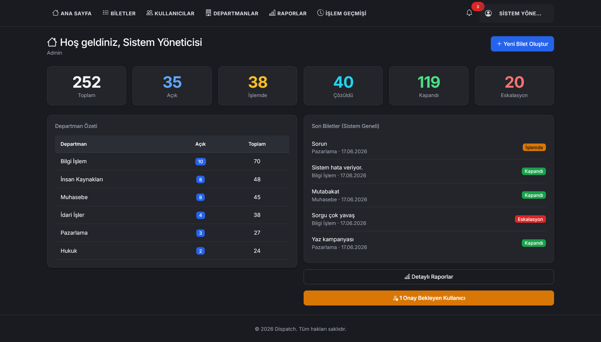
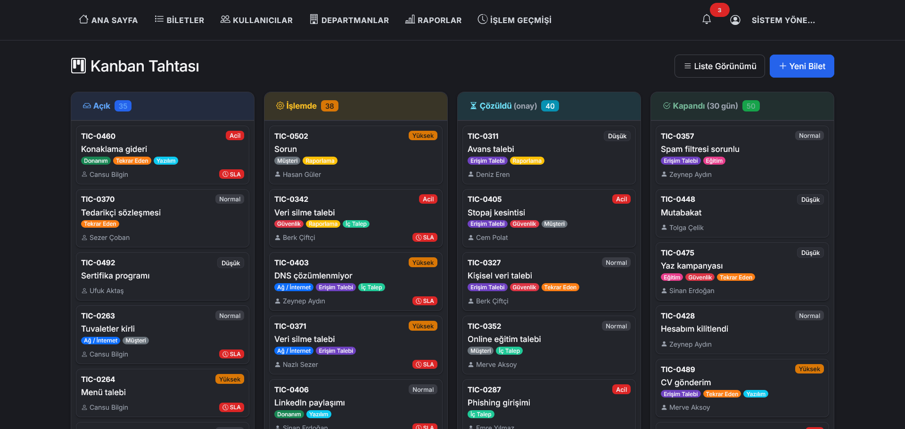
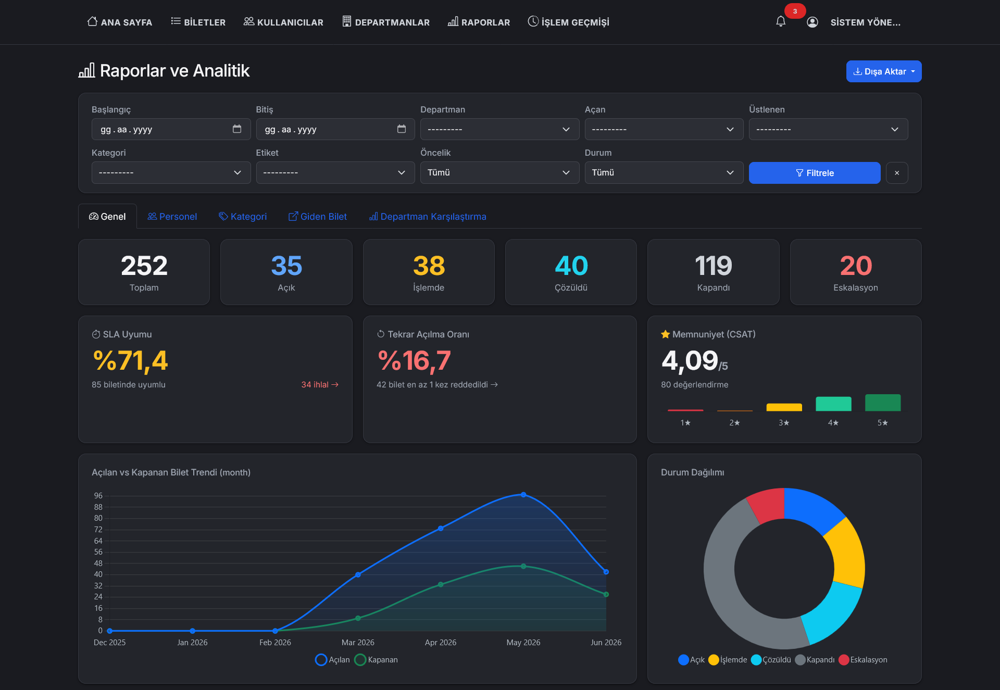

# Dispatch

> A hardened, server-rendered internal **service & ticket management system** with role-based access, business-hours SLAs, auto-assignment, and full TR/EN internationalization.

Dispatch is a Django-based **help-desk / dispatch platform** for handling internal support requests end to end. Employees open tickets, the system routes them to the right department and auto-assigns an available agent, and managers track everything against business-hours SLAs. A full ticket lifecycle, escalation, satisfaction ratings, and rich reporting (CSV / Excel / PDF) are built in — and security is baked in from authentication to file uploads.

## 🚀 Features

- **Full ticket lifecycle**: Open → In Progress → Resolved → Closed, plus Escalated — with reopen limits, requester resolution confirmation, and automatic closing of stale tickets.
- **Smart auto-assignment**: round-robin routing per department with a per-agent active-ticket cap, so no one is overloaded.
- **Role-based access control**: Employee, Agent, Manager, and Admin roles — each sees and does only what its role allows.
- **Business-hours SLAs**: due dates computed from working hours (Mon–Fri, 09:00–18:00) per priority — Urgent 4h, High 24h, Normal 72h, Low 168h — with overdue tracking, progress bars, and early-warning notifications.
- **Departments & categories**: organize work, toggle auto-assign per department, and route tickets accordingly.
- **Collaboration**: threaded comments, file attachments, color-coded tags, and a full per-ticket action history / audit trail.
- **Escalation & CSAT**: escalate stuck tickets and collect a satisfaction rating once they're resolved.
- **In-app notifications**: live unread counter and per-ticket alerts for assignments, status changes, and SLA warnings.
- **Reporting & exports**: a metrics dashboard with one-click export to **CSV**, **Excel** (`.xlsx`), and print-ready **PDF**.
- **Bilingual (TR / EN)** + **dark mode**: switch the whole interface instantly; preference is remembered.

## 🛠️ Tech Stack

| Layer | Technologies |
| --- | --- |
| **Backend** | Python 3.13, Django 6.0 |
| **Frontend** | Django server-side templates, vanilla JS, custom CSS (light/dark theme) |
| **Database** | PostgreSQL 17 (`psycopg2`) |
| **Security** | django-axes (brute-force lockout), Django password validators, hardened upload validation, HSTS / secure cookies / CSP-style headers |
| **Documents & Media** | WeasyPrint (PDF), openpyxl (Excel), Pillow (image handling) |
| **Tooling / DevOps** | Gunicorn, Docker, Docker Compose, gettext (i18n) |

## 📦 Installation

### Prerequisites

- Python ≥ 3.13
- PostgreSQL — or use the bundled Docker setup
- Docker & Docker Compose (optional, recommended)
- WeasyPrint system libraries for PDF export (handled automatically inside Docker)

On Linux, the PDF/image system libraries can be installed with:

```bash
sudo apt install libpango-1.0-0 libpangocairo-1.0-0 libgdk-pixbuf-2.0-0 libffi-dev libcairo2
```

### 1. Clone & install

```bash
git clone https://github.com/batuhanmeral/Dispatch.git
cd Dispatch
python -m venv .venv
source .venv/bin/activate        # Windows: .venv\Scripts\activate
pip install -r requirements.txt
```

### 2. Configure environment

Copy the example file and fill in your values:

```bash
cp .env.example .env
```

```env
# Generate a key with:
#   python -c "from django.core.management.utils import get_random_secret_key; print(get_random_secret_key())"
SECRET_KEY=change-me-to-a-50-char-random-string

DEBUG=True                       # set to False in production
ALLOWED_HOSTS=localhost,127.0.0.1
CSRF_TRUSTED_ORIGINS=            # e.g. https://dispatch.example.com (required behind HTTPS)

# Database
DB_NAME=dispatch_db
DB_USER=postgres
DB_PASSWORD=change-me-strong-password
DB_HOST=localhost               # overridden to "db" by docker-compose
DB_PORT=5432
```

> When `DEBUG=False`, Dispatch automatically enables HTTPS redirects, HSTS, and `Secure`/`HttpOnly` cookies. See [Security](#-security) below.

### 3. Set up the database & run

```bash
python manage.py migrate
python manage.py createsuperuser
python manage.py runserver
```

The app is now available at `http://localhost:8000`.

### Run with Docker (app + PostgreSQL)

```bash
docker compose up -d --build
```

Compose provisions PostgreSQL 17 with a healthcheck and persistent volumes, runs migrations and `collectstatic` on boot, and serves the app via Gunicorn as a non-root user. The web container is published only on `127.0.0.1:8000` and the database is never exposed to the host.

## 💡 Usage

### Seed demo data (optional)

Bootstrap sample departments, users, and tickets to explore the app quickly:

```bash
python manage.py seed_demo --reset

# inside Docker:
docker compose exec web python manage.py seed_demo --reset
```

Default demo accounts:

| User | Role | Password |
| --- | --- | --- |
| `admin` | Admin | `admin123` |
| sample manager / agent / employee | Manager · Agent · Employee | `pass123` |

### How a ticket flows

1. An **employee** opens a ticket (subject, message, priority).
2. Dispatch routes it to a **department** and **auto-assigns** an available agent (round-robin, respecting load limits).
3. An **SLA due date** is calculated from business hours based on priority.
4. The **agent** works the ticket; status moves through the lifecycle, with comments, attachments, and a full history recorded.
5. On resolution the requester **confirms** and leaves a **CSAT rating**; unconfirmed tickets **auto-close** after a few days.
6. Overdue or stuck tickets can be **escalated**, and **SLA-warning** notifications fire before deadlines are missed.

### Roles & permissions

| Capability | Admin | Manager | Agent | Employee |
| --- | :---: | :---: | :---: | :---: |
| Open & track own tickets | ✓ | ✓ | ✓ | ✓ |
| Work / resolve assigned tickets | ✓ | ✓ | ✓ | — |
| Manage departments, categories & assignments | ✓ | ✓ | — | — |
| Reports & exports (CSV / Excel / PDF) | ✓ | ✓ | — | — |
| User & system administration | ✓ | — | — | — |

## 🔒 Security

Security is enforced across the stack, not bolted on:

- **Brute-force protection** — django-axes locks an account/IP after 5 failed logins for 15 minutes.
- **Strong passwords** — Django's full password-validator suite (length, common-password, numeric, and similarity checks).
- **Hardened file uploads** — avatars are validated by extension, size, **and** real content (not just the filename).
- **Production headers** (auto-enabled when `DEBUG=False`) — HSTS with preload, HTTPS redirect, `Secure` + `HttpOnly` cookies, `SameSite=Lax`, `X-Frame-Options: DENY`, `nosniff`, and a strict referrer policy.
- **CSRF protection** on every form, with configurable trusted origins for HTTPS deployments.
- **Hardened container** — runs as an unprivileged user with all Linux capabilities dropped and `no-new-privileges`; secrets stay in `.env` and never enter the image.

## 🗂️ Project Structure

| App | Responsibility |
| --- | --- |
| `identity` | Custom user model, authentication, roles, and audit logging |
| `departments` | Departments, categories, and auto-assignment configuration |
| `tickets` | Ticket lifecycle, SLAs, assignment, comments, attachments, history |
| `notifications` | In-app notifications and the unread-count badge |
| `reports` | Dashboard metrics and CSV / Excel / PDF exports |
| `config` | Project settings, URLs, and the role-based landing dashboard |

## 📸 Screenshots

> Shown in dark mode.

### Dashboard



### Kanban Board



### Reports



## 📄 License

Released under the [MIT License](LICENSE). © 2026 Batuhan Meral.
